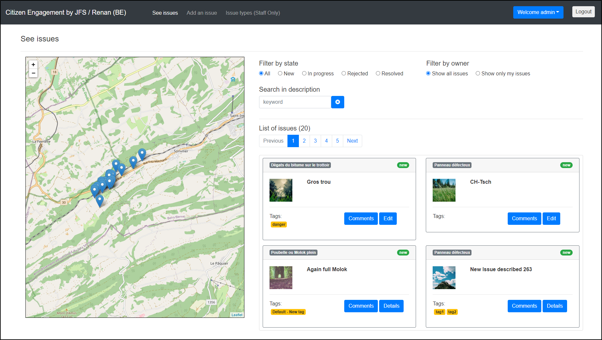

# Citizen Engagement
Ce repository contient les sources du projet "Citizen Engagment" réalisé dans le cadre du CAS-DAR DFA / Angular 2020.

# Description de l'application
L'application "Citizen engagement" permet aux citoyens de signaler et commenter des problèmes détectés dans leur localité. Ces problèmes pourront ensuite être corrigés par les personnes compétentes et leur état mise à jour dans l'application (pas implémenté).

Pour ma part les issues ont été centralisées sur la localité de RENAN (BE).



L'application utilise l'API suivante pour le stockage des toutes les informations liées aux issues :
https://mediacomem.github.io/comem-citizen-engagement-api/

L'adresse dédiée de l'API pour mon utilisation est :  
https://masrad-2020-ce-jean-francois.herokuapp.com/api

# Utilisation de l'application
L'utilisation de l'application est relativement simple et le menu permet de voir rapidement les fonctions à disposition. Voici quelques informations complémentaires :

## Login ou nouvelle inscription
En arrivant sur l'adresse de l'application `http://localhost:4200/` on peut soit se connecter avec un login existant:

 

Ou alors créer un nouveau compte (New user registration)


## Liste des utilisateurs
 Deux types différents d'utilisateur sont possibles :

* Citizen :  Peut ajouter des issues ou modfier ces proopres issues. Il peut également commenter les issues des autres.
* Staff :	Peut ajouter des types d'issue ou changer le status d'une issue (pas implémenté). Peut également faire tout ce que le Citizen peut faire.

Quelques utilisateurs sont déjà crées et peuvent être utilisés pour les tests et comprendre le fonctionnement. Différrents issues ont été créées par différents utilisateurs.

### Utilisateur avec droits "Citizen"
* Username : jeanfrancois / Password : 1234 
* Username : jdoe / Password : changeme
* Username : usera / Password : usera 
* Username : userz / Password : userz

### Utilisateur avec droits "Staff"
* Username : admin / Password : admin

## Visualisation des issues (See issues)
Une fois connecté, on se trouve sur cette page qui liste les issues.

On peut ici effectuer un filtrage ou recherche des issues. La carte affiche toujours les marqueurs des issues filtrées.

On peut également depuis cette page éditer une issue que l'on a créé, voir les détails d'une issue ou encore voir et ajouter des commentaires.


## Visualisation ou ajout de commentaires sur une issue
Cette page permet la visualisation ou l'ajout d'une issue avec toutes les informations à fournir. Les issues existantes sont affichées sur la carte pour ne pas ajouter une issue déjà existante.


## Ajout d'une issues (Add issue)
Cette page permet l'ajout d'une issue avec toutes les informations à fournir. Les issues existantes sont affichées sur la carte pour ne pas ajouter une issue déjà existante.

L'emplacement de la nouvelle issue peut être indiqué en cliquant sur la carte ou en utilisant le bouton qui indique l'emplacement actuel de l'utilisateur.


## Gestion des types d'issue (Issue types)
`Seulement visible pour les utilisateurs Staff !`

Cette page permet la visualisation et l'ajout d'une issue types avec toutes les informations à fournir. La suppression et la modification d'un type d'issue ne sont pas implémentées.


# Choix lors du développement
Quelques explications sur certains choix pris durant le développement.

## Structure des sources

\Src\App

* \alerts :	Gestion des alerters et messages
* \api : 	Gestion de l'API
* \issues :	Gestion des issues (manage issue, list issues, manage issue comments,..) 
* \map :	Gestion de la carte 
* \models :	Modèles de données pourl l'API ou autre
* \newregistration-page : Gestion de la page pour une nouvelle inscription 
* \securtiy : Gestion du login, logout ou des guards 
* \shared	: Gestion des services partagés dans l'application
* \user-menu :	Gestion du menu pour l'utilisateur (profile pas implémenté)

\Doc

* Mockup de l'interface visuelle (utilisé surtout au début du projet). Plus vraiment à jour.
* Quelques capture d'écrans de l'application

## List des issues
Lors de la visualistion des issues, TOUTES les issues sont demandées à l'API. Ensuite des possibilités de filtre ou de pagination peuvent être faite. Cette méthode a permis d'utiliser et comprendre les méthodes de filtrage ou de recherche dans les tableaux. 
Par contre il serait plus judicieux de récupérer les issues par page, comme fait pour les commentaires des issues.

## Chargement des commentaires par issue:
Réalisé par un service qui charge par page et non pas tous.

## Utilisation de pattern de validation de champs
Pour le contrôle de la saisie des champs des formulaire, on utilise des patterns (regex) qui sont définis dans l'environnement et donc utilisables à plusieurs endroits.

## Formulaire "Edit Issue" pour l'édition et la visualisation
Ce formulaire (manageIssueComponent) est utilisé pour l'ajout, l'édition et la visualisation des données d'une issue.
Des conditions ngIf, [hidden] et [disabled] sont utilisés sur les composants pour changer l'état en fonction de si :
* on édite (isEditable), 
* si on ajoute (isNewIssue) 
* ou encore si c'est une propre issue de l'utilisateur connecté (isUserIssue)

## Ajout d'une issue
Lors de l'ajout d'une issue, l'application tente de récupérer la position de l'utilisateur.

Si elle n'est pas autorisée, on utilise le point centrale du village, mais l'utilisateur peut cliquer sur la carte pour indiquer l'emplacement.

Après l'ajout d'une issue, on reste sur la fenêtre d'ajout.

## Information formulaires
Template Driver avec validation et contrôle des "required"
- Newregistration.html
- ManageIssue.html
- ManageIssueComment
- NewRegistration
- ..

## Dives autres choix faits
* Lors de la mise à jour d'une issue, on renvoit toutes les infos de l'issue et non pas seulement celle qui ont changées
	--> amélioration possible.

# Ressources externes utilisées
## Libraires
ngx-bootstrap

bootstrap

## Icon used
Bootstrap n'inclut ps d'icone par défaut.

Utilisation de ceux de Font Awesome (https://fontawesome.com/)

Installation selon https://softaox.info/best-way-to-use-bootstrap-and-fontawesome-using-npm-in-angular-app/

``` markdown
code : npm install font-awesome --save
```

## Autres Ressources et aides utilisées
Pagination ngx-bootstrap : https://valor-software.com/ngx-bootstrap/#/pagination

Pagination help : https://dimitr.im/pagination-component-angular-2

# Améliorations possibles (beaucoup)
* Lors de la récupération des comments ou des issue types par page, il faudrait pouvoir extraire de la réponse le nombre total dispo (actuellement fixe)
* L'affichage des alerts (en haut à droite) ne devrait pas faire descendre le reste des infos. Pénible visuellement
* Contrôle dans le New registration qu'un rôle a bien été sélectionné
* Affichage de l'adresse en combinaison des coordonnées Lat/Long
* Dans la liste des issues, un click sur une issue indique le marker (couleur)
* Lors de l'édition d'une issue, afficher le marqueur en couleur.
* Formattage des dates au format local (fr)
* Lors de l'affichage d'alerte, cela ne devrait pas décaler vers le bas le reste de l'affichage
* Définir une limite pour l'ajout des marker (limite de la commune)
* Amélioration de l'interface utilisateur
* Mémorisation de la naviguation pour faciliter les retours en arrière et revenir à l'état d'avant (surtout lors du retour à "See issues")
* ...

# Remarques sur le projet
Le dévelopement de cette application était très intéressant et le sujet m'a motivé.  

Par contre le dévelopement d'une telle application avec les fonctionnalités requises a été difficile. Les connaissances et la faible expérience pratique acquise durant les cours a rendu le développement difficile et pris beaucoup de temps.

Beaucoup de choses nécessaires ont été touchées durant les cours, mais la mise en pratique sans expérience est très difficile et on perd vite du temps à comprendre comment faire intéragir les composants ou les services. Après plusieurs dizaines d'heures et plusieurs compsants ajoutés, on comprend mieux ce que l'on fait...

L'aspect visuel (UI avec bootstrap) et aussi quelque chose qui prend du temps à comprendre (grid) et à mettre en place pour que cela affiche ce que l'on veut et comme on l'aimerait. 

Pour information, le temps de développement passé sur ce projet est d'environ : 250h

# CitizenEngagement - Info de base générées à la création du projet

This project was generated with [Angular CLI](https://github.com/angular/angular-cli) version 9.1.7.

## Development server

Run `ng serve` for a dev server. Navigate to `http://localhost:4200/`. The app will automatically reload if you change any of the source files.

## Build

Run `ng build` to build the project. The build artifacts will be stored in the `dist/` directory. Use the `--prod` flag for a production build.


Markdown sheet :
https://guides.github.com/pdfs/markdown-cheatsheet-online.pdf